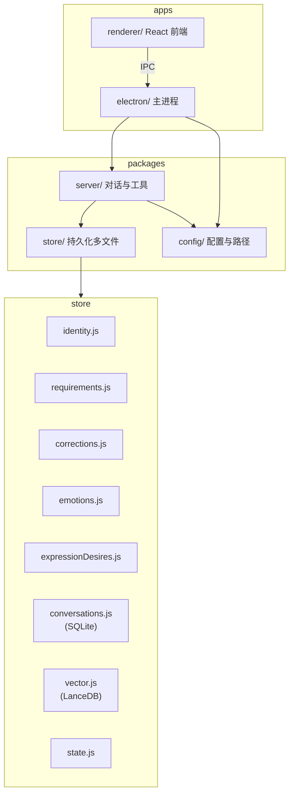

# Aris v2 架构

## 原则

- v2 与现网（项目根 `src/`）完全隔离，不引用现有代码与数据目录。
- 记录（身份、要求、纠错、情感、表达欲望）仅由 LLM 通过工具写入，禁止代码内正则/关键词解析自动写入。
- 对话库沿用 **SQLite**，向量库沿用 **LanceDB**，仅路径与封装在 v2；向量数据只存向量库，不写入 .md。

## 架构图

## 数据流

- **对话**：用户消息 → Electron IPC → server/handler → 组 prompt（方案 A）→ LLM（含 tools）→ 执行工具 → 写 conversations（SQLite）、向量块（LanceDB）、state。
- **记录**：仅当 LLM 调用 record_* 工具时，handler 执行工具 → store 对应模块写入（identity/requirements/corrections/emotions/expressionDesires）。
- **检索**：search_memories 工具 → store/vector.search（query 加 search_query:）→ 返回片段注入或供模型使用。

## 记忆的数据库

| 类型     | 技术   | v2 封装        | 用途           |
|----------|--------|----------------|----------------|
| 对话流水 | SQLite | conversations.js | 完整历史、拼块、展示 |
| 可检索记忆 | LanceDB | vector.js      | 语义搜索、按类型/时间 |
