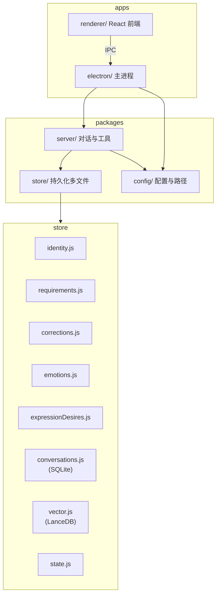

# Aris v2 架构

## 原则

- v2 与现网（项目根 `src/`）完全隔离，不引用现有代码与数据目录。
- 记录（身份、要求、纠错、情感、表达欲望）仅由 LLM 通过工具写入，禁止代码内正则/关键词解析自动写入。
- 对话库沿用 **SQLite**，向量库沿用 **LanceDB**，仅路径与封装在 v2；向量数据只存向量库，不写入 .md。

## 架构图

## 数据流

- **对话**：用户消息 → Electron IPC → server/handler → 组 prompt（方案 A）→ LLM（含 tools）→ 执行工具 → 写 conversations（SQLite）、向量块（LanceDB）、state。
- **记录**：仅当 LLM 调用 record_* 工具时，handler 执行工具 → store 对应模块写入（identity/requirements/corrections/emotions/expressionDesires）。
- **检索**：search_memories 工具 → store/vector.search（query 加 search_query:）→ 返回片段注入或供模型使用。

## 记忆的数据库

| 类型     | 技术   | v2 封装        | 用途           |
|----------|--------|----------------|----------------|
| 对话流水 | SQLite | conversations.js | 完整历史、拼块、展示 |
| 可检索记忆 | LanceDB | vector.js      | 语义搜索、按类型/时间 |

## 与现网关系

- **现网**：项目根目录下的 `src/`、`memory/` 等为现有线上或本地 v1 实现。
- **v2**：完全独立于现网。代码仅位于 `v2/` 下，数据目录、SQLite、LanceDB 路径均使用 v2 配置（如 `v2/data/` 或 Electron 用户数据路径），**不引用、不读取、不写入** 项目根 `src/` 或现网 memory。
- 可同时保留 v1 与 v2 两套实现，按需切换运行入口。

## 对话库与向量库在流程中的角色

- **对话库（SQLite / conversations.js）**
  - **写入**：每次用户发送消息 → handler 先 append 用户条；LLM 回复（含工具调用）结束后 append 助手条。Proactive 主动发话时由 proactive 模块 append 助手条。
  - **读取**：handler 组 prompt 时 getRecent 取当前会话最近 N 条；proactive 取最近若干条做上下文。
  - **职责**：完整对话流水、拼进 context、前端展示；不做语义检索。

- **向量库（LanceDB / vector.js）**
  - **写入**：handler 在每轮对话结束后，将本轮「用户+助手」结构化拼块后 vector.add；record_memory 工具调用时 add 用户指定内容；proactive 发送主动消息后 add 一条 aris_behavior。
  - **读取**：search_memories 工具 → vector.search，结果注入或供模型参考；proactive 可选做语义检索（当前实现以情感/表达欲望 JSON 为主）。
  - **职责**：语义检索、长期记忆；不替代对话库的逐条历史。
