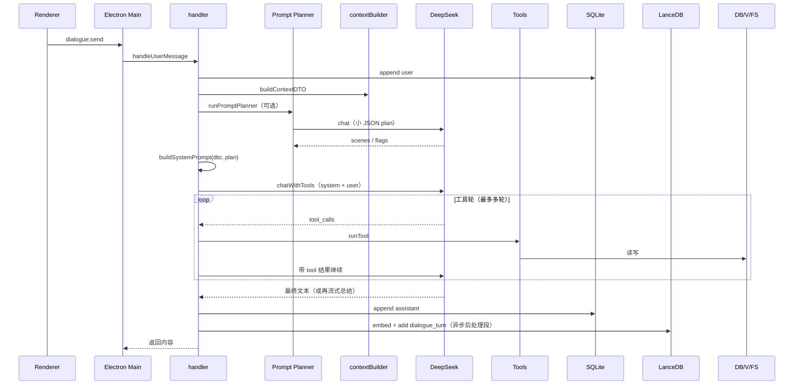

# Aris v2：架构与产品逻辑总览

> 本文从**专业 Agent 产品**视角整理 Aris v2 的现状：能力边界、数据流、记忆与工具、以及设计取舍。  
> 面向：产品/架构评审、 onboarding、与外部方案（如独立意图中台、混合检索论文）对照。

---

## 1. 产品定位（Agent 视角）

| 维度 | Aris v2 的现状 |
|------|----------------|
| **形态** | 桌面端 **Electron** 应用：主进程承载对话与数据，渲染进程为聊天 UI。 |
| **人格** | 强人设（`persona.md`）：平等对谈、非客服腔；可经 `memory/conversation_rules.md` 覆盖语气与情境规则。 |
| **智能体范式** | **单主模型 + 工具循环**（DeepSeek `chat/completions` + `tools`），非多 Agent 编排框架。 |
| **记忆哲学** | **结构化事实**（JSON 文件 + SQLite）与 **语义经历**（LanceDB 向量）并存；长列表不默认灌满 system，倾向 **按需工具检索**（`search_memories` 等）。 |
| **关系型能力** | **主动消息**（定时 + 状态机）、**安静/低功耗**（用户显式或长时间无回复）、**情感/表达欲望** 等「陪伴」向状态，与任务型 Copilot 不同。 |

**一句话**：Aris 是「带人格与长期状态的桌面陪伴型对话 Agent」，工程上采用 **BFF 式对话层**（`handler` + `contextBuilder` + `prompt`）+ **显式工具** + **本地持久化**，而不是云端多服务微架构。

---

## 2. 技术分层（仓库结构）

```
v2/
├── apps/
│   ├── electron/          # 主进程：IPC、窗口、调用 packages/server 的 handleUserMessage
│   └── renderer/          # 前端 UI（React 等）
├── packages/
│   ├── server/            # 「大脑」侧：对话 handler、LLM 客户端、工具实现、proactive
│   ├── store/             # 数据：SQLite 对话、LanceDB 向量、各类 memory JSON、facade
│   └── config/            # 路径、常量、memory 文件名映射
├── persona.md / rules.md  # 仓库内默认人设与规则（可被 memory 覆盖）
└── data/（或 Electron userData） # 运行时数据目录
```

- **对话 API**：`packages/server/llm/client.js` — DeepSeek 兼容接口（`deepseek-chat`），流式在 `stream.js`。  
- **向量嵌入**：`packages/store/vector.js` — **Ollama** `embeddings` API（默认 `nomic-embed-text`），与对话模型解耦。  
- **数据门面**：`packages/store/facade.js` — 上层不直接散落调用各 store 文件，统一「读上下文 / 写对话 / 写向量块」等。

---

## 3. 单轮用户消息：端到端逻辑

下面是一条用户发送消息到回复落库的**主路径**（忽略异常与中止）。



### 3.1 上下文计划（固定，无前置编排 LLM）

- **作用**：`prompt.js` 中 `CHATBOT_CONTEXT_PLAN` 固定为 **全文约束 + 三场景全开 + 注入小结/关联/状态** 等与旧版接近的体量。  
- **主对话**：`buildMainDialogueMessages` 将人设与规则拆成多段 `messages`（利于前缀缓存），见 `prompt_packaging.md`。

### 3.2 主对话：工具循环

- **入口消息**：当前实现里，主模型上下文为 **多段 messages**（短 system + 规则对与易变对 + 滑动历史 + 当前用户）；近期多轮亦出现在历史段中（具体见 `prompt.js` / `contextBuilder`）。  
- **工具**：`getTools()` 返回内置工具列表；`chatWithTools` 非流式返回，直到无 `tool_calls` 或达到上限。  
- **无自然语言回复时的补救**：若仅有工具调用而无可用正文，会再调 **流式** 生成一句总结（避免用户只看到空白）。  

### 3.3 后置：向量写入与会话小结

- **向量**：每轮结束后，将最近若干轮对话拼成 **一块文本**，经 **document 前缀** 的 embedding 写入 LanceDB，`type` 多为 `dialogue_turn`，`metadata` 含 `session_id`、`related_entities`（身份 + requirement 等，用于分层过滤）。  
- **小结**：`setImmediate` 触发 `maybeGenerateSummary` — **异步**，不阻塞返回；用于 `session_summaries` 等，供后续 prompt 注入。  

---

## 4. 记忆体系（三层）

| 层级 | 载体 | 用途（Agent 产品语言） |
|------|------|------------------------|
| **A. 符号/结构化记忆** | `memory/*.json`、SQLite 中的对话与状态 | 身份、要求、纠错、喜好、关联实体、安静词、行为配置等 — **可精确读写、可备份恢复**。 |
| **B. 语义记忆（可检索经历）** | LanceDB 表 `memory` | 对话块、主动消息等 **嵌入向量**；通过 `search_memories` **按需召回**，避免全量进 prompt。 |
| **C. 会话内上下文** | system 中的近窗 + 可选 session summary | **当前线程 coherence**；与长期记忆分工明确。 |

**检索策略（现状）**：`packages/store/vector.js` 默认 **向量 ANN + MiniSearch（BM25 风格全文）混合召回**，在 **Top-K 候选池** 内 **余弦融合** 后进入第二阶段 **RRF（倒数排名融合）+ 查询字面覆盖**（`memoryRerankStage2.js`），再乘 **相似度/时间** 权重（**默认时间权重为 0**，相关性优先）。`search_memories` 工具侧另有 **类型权重** 与 **字面重叠微调**（`memory.js`），以及可选 **按关联实体过滤** 与 **`memory_row_time_decay`**（默认关）。`ARIS_MEMORY_HYBRID=false` 时回退为纯向量 + 可选时间项；`ARIS_MEMORY_FINAL_STAGE2=false` 时回退旧「混合余弦 + 时间」排序。

---

## 5. 工具全景（能力地图）

以下为产品级归类（具体以 `packages/server/dialogue/tools/` 为准）。

| 类别 | 代表能力 |
|------|----------|
| **记录类** | `record`：identity、requirement、preference、correction、emotion、expression_desire、self_note 等 — **长期人设与约束的来源**。 |
| **文件与项目** | `read_file`、`write_file`、`list_my_files`、目录/读缓存、`search_repo_text`（按关键词搜路径，优先 rg）等 — **桌面 + 工作区** 绑定。 |
| **记忆检索** | `search_memories`、`get_conversation_near_time`、`get_user_profile_summary` 等 — **RAG 入口**。 |
| **应用与环境** | `get_my_context`、`restart_application` 等 — **自我边界与运维级动作**。 |
| **时间与 Git** | 时间查询、git 相关 — **辅助事实**。 |
| **网络（可选）** | `fetch_url` — 受 `network_config.json` 约束，主进程延迟加载以降低启动风险。 |

**设计原则（观察）**：敏感持久化以 **工具写入** 为主，避免后台静默篡改用户文件；与「伴侣」定位一致的是 **表达欲望、主动消息、情感** 等与 **状态机** 联动。

---

## 6. 主动消息与静默（状态机）

- **触发**：定时器 + 用户最近活跃时间 + 低功耗标志 + 表达欲望/情感等。  
- **保守模式**：可仅用积累的表达欲望，不调用 LLM 生成主动句（配置项）。  
- **静默路径**：用户说安静词 → **低功耗**；或连续多轮主动无回复 → 自动静默。  
- **恢复**：新用户消息且非安静词时退出低功耗（`handler` 与 `proactive` 协同）。

这在 Agent 产品里属于 **「主动性 / 打扰度」治理层**，与核心对话链路 **解耦**，便于单独调参。

---

## 7. 外部依赖与延迟构成

| 组件 | 依赖 | 对体验的影响 |
|------|------|----------------|
| 主对话 + 工具 | DeepSeek API | **首包与每轮工具**的主要延迟与成本。 |
| Prompt Planner | 同 DeepSeek | **额外一整轮**请求（可关）；用于省 token 与注入控制。 |
| 向量 | Ollama（本机） | 对话**不依赖**；无 Ollama 时向量库不可用，`search_memories` 降级。 |
| 嵌入写入 | 每轮结束后本地调用 | 失败通常只打日志，**不阻断**已返回的回复。 |

---

## 8. 专业视角：优势与典型缺口

### 8.1 优势

- **上下文工程清晰**：Planner + brief/全文开关 + 场景块，**可观测、可关闭、可 A/B**（通过关 Planner 对比体量）。  
- **记忆双轨**：结构化 + 向量检索 + 工具按需，符合 **「Agent 不堆无限 context」** 的实践。  
- **桌面一体化**：数据本地、导出 `.aris`、Electron 集成 — 适合 **单用户长期关系** 产品。  
- **陪伴向状态机**：主动/静默/情感 — 与纯「编码助手」差异化明显。

### 8.2 典型缺口（非评判，便于 roadmap）

- **检索**：纯向量 + 规则权重；专名/关键词弱于混合检索（行业通用增量）。  
- **意图**：三场景标签 + Planner，**非**开放域动态意图库 — 复杂度可控，扩展新「场景类」需产品定义 + 代码枚举。  
- **观测**：token 监控、timeline 有；若要做 **线上质量看板**，需另建埋点与分析层。  
- **多模态**：当前以文本为主（与架构一致）。

---

## 9. 与常见「重型方案」的对照句

- **动态意图中台 + 向量意图库**：Aris 已用 **Planner** 承担「软路由」；再叠一层自动增生意图，**收益/复杂度比**需单独论证。  
- **混合检索 + Cross-Encoder**：与 **LanceDB + Ollama** 可渐进结合，属 **检索子系统** 升级，不改变「单主 Agent + 工具」拓扑。  

---

## 10. 文档信息

- **范围**：`v2` 目录下实现；与旧版根目录 `src/` **隔离**。  
- **更新**：若重大行为变更（如新工具类、Planner 字段、记忆写入路径），应同步修订本节对应段落。  
- **体验优化与 Planner 推荐策略**：见 [`ux_optimization_implementation_plan.md`](ux_optimization_implementation_plan.md)（含 P2「先 A、急则 B、C 看数据、D 远期」等已收录结论）。

---

*本文档描述「现状与逻辑」，不包含仓库维护规范；配置项细节仍以 `README.md` 与 `docs/prompt_packaging.md` 等为准。*
