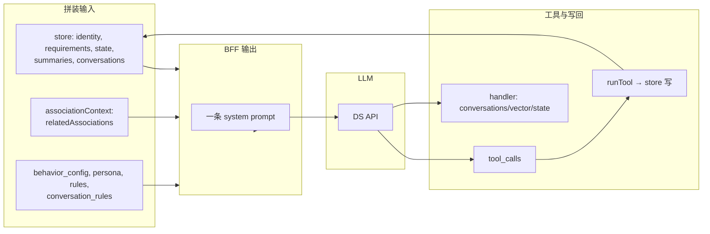
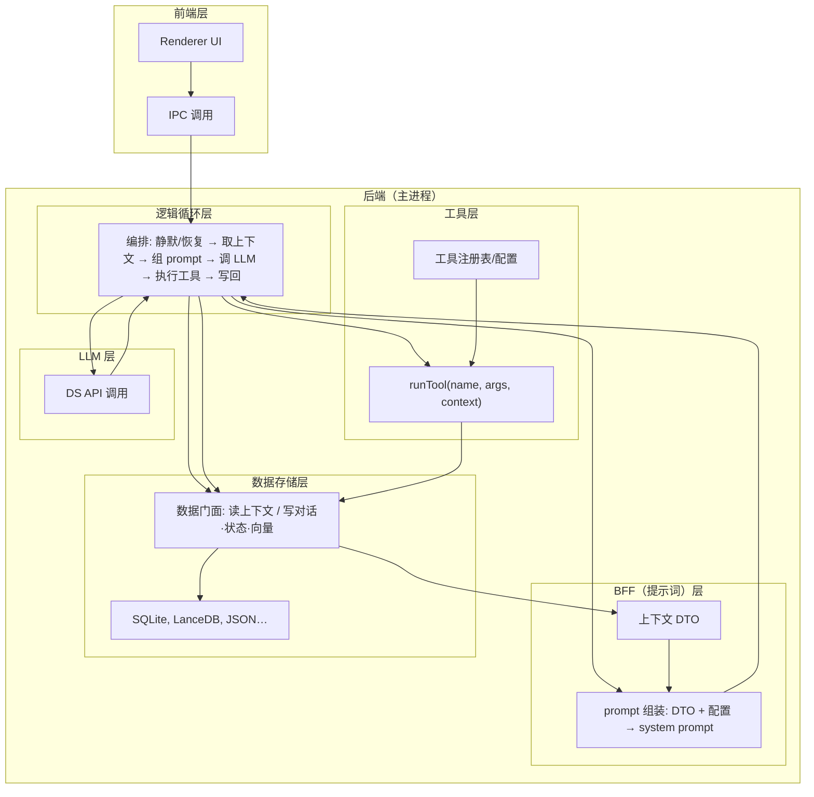

# Aris v2 架构解耦与流程说明

本文档回答四类问题：  
1）底层架构耦合与拆分思路；  
2）工具层是否存在过多耦合与冗余；  
3）当前记忆、提示词、逻辑的组成与完整流程图；  
4）五层拆分（LLM / BFF / 工具 / 逻辑循环 / 数据层）的纠正与补充。

---

## 一、当前架构耦合问题与拆分思路

### 1.1 现状：谁依赖谁

| 层级 | 当前实现位置 | 依赖了谁 | 被谁依赖 |
|------|--------------|----------|----------|
| **LLM 层** | `packages/server/llm/client.js` | config（env）、无 store | handler、proactive |
| **提示词层** | `dialogue/prompt.js` + **handler 内 buildPromptContext** | config/paths、store（通过 handler 传参）、**tools/network.js**（isNetworkFetchEnabled） | handler |
| **工具层** | `dialogue/tools/*.js` | **store**、**config/paths**、**associationContext**（memory 用）、file 里 **getTools**（get_my_context） | handler、proactive |
| **逻辑循环层** | `dialogue/handler.js`（含 prompt 组装 + 工具循环 + 写库） | prompt、tools、llm、store、quietResume、associationContext、summaryGeneration | electron main（IPC） |
| **数据层** | `packages/store/*.js` | config/paths、fs、sqlite、lancedb | handler、tools、prompt（通过 handler 取数）、proactive、electron/backup |

主要耦合点：

- **handler** 既做「提示词组装」（读 store、调 buildSystemPrompt、再注入 emotion 等），又做「工具循环」「写会话/向量/状态」→ 提示词层与逻辑层混在一起。
- **prompt.js** 依赖 **tools/network.js**（是否暴露 fetch_url）和 **readBehaviorConfig**，且 **buildSystemPrompt** 里写死「需要时可调用 get_my_context / fetch_url」→ 提示词与工具配置耦合。
- **工具实现** 直接 require store、paths、associationContext → 工具层与数据层、配置层强耦合；**get_my_context** 再调 **getTools()** → 工具与工具列表耦合。
- **数据层** 被 handler、所有 record/get 类工具、prompt 组装逻辑多处直接读写的分散调用 → 没有单一「数据门面」，难以做读写策略/审计。

### 1.2 拆分思路（按层解耦）

1. **LLM 层只做「与 DS API 的对话发送」**  
   - 输入：`messages`、`tools`（可选）、`signal`。  
   - 输出：`{ content, tool_calls, usage, error, aborted }`。  
   - **不**读 store、不读 config（API Key/URL 由上层注入或通过极薄 adapter 读环境），不感知「对话策略」。

2. **BFF / 提示词层只做「提示词组装」**  
   - 输入：会话上下文（由上层从 store 取好）、配置（行为开关、可选规则）。  
   - 输出：**一条 system prompt 字符串**（或 structured segments，由 BFF 拼成一条）。  
   - **不**直接 require 具体 tool 实现；是否暴露某工具、工具列表由「工具层」提供，BFF 只负责在 system 里写「你能用什么」的**描述**（或由逻辑层把工具描述和 system 一起交给 LLM）。

3. **工具层只做「工具配置 + 执行」**  
   - **配置**：工具列表（name、description、parameters）由配置或注册表产出，不散落在各 runXxx 里重复写。  
   - **执行**：`runTool(name, args, context)` 只依赖「数据门面接口」（见下），不直接 require 具体 store 子模块；store 由上层注入或通过 context 传入。  
   - 去掉「工具内部再调 getTools()」这类反向依赖（如 get_my_context）。

4. **逻辑循环层只做「LLM 调用循环与策略」**  
   - 职责：静默/恢复判断 → 取会话与上下文 → **调用 BFF 组装 prompt** → 调用 **LLM 层** → 若有 tool_calls 则调 **工具层** → 根据结果决定继续循环或结束 → 写会话/向量/状态（或委托给「数据门面」的写接口）。  
   - **不**在 handler 里直接读 identity/requirements/state/summaries 拼字符串（这些交给 BFF）；不直接写 store.xxx，而是通过统一写入接口。

5. **数据层提供「门面」**  
   - 对上层暴露「读上下文」「写对话/状态/向量」等粗粒度接口，而不是让 handler/tools 到处 `store.identity.read`、`store.conversations.append`。  
   - 工具执行时通过 **context** 拿到「数据门面」或只读/只写接口，避免工具与 store 子模块直接耦合。

这样：**LLM ↔ 只认 messages/tools；BFF ↔ 只认「上下文结构」与配置；工具 ↔ 只认 name/args/context；逻辑层 ↔ 只编排 BFF、LLM、工具、数据门面。**

---

## 二、工具层：数量、耦合与冗余

### 2.1 当前工具清单（约 33 个，network 按开启计）

| 模块 | 工具名 | 数量 | 说明 |
|------|--------|------|------|
| **record** | record_user_identity, get_user_identity, record_user_requirement, record_correction, record_emotion, record_expression_desire, record_association, get_associations, record_preference, get_preferences, record_friend_context, get_expression_desire_context, append_self_note, append_exploration_note, get_exploration_notes, get_recent_emotions | 18 | 身份/要求/纠错/情感/表达欲望/关联/偏好/朋友情境/自我笔记/探索笔记 |
| **file** | list_my_files, read_file, write_file, delete_file, get_my_context | 5 | 文件与运行环境 |
| **memory** | search_memories, get_conversation_near_time, get_user_profile_summary, search_memories_with_time | 4 | 检索、按时间会话、画像、带时间窗口检索（纠错与禁止用语已每轮注入【用户约束】，无单独工具） |
| **time** | get_current_time | 1 | 当前时间 |
| **git** | git_status, git_log | 2 | 仓库状态与日志 |
| **network** | fetch_url | 1 | 网页抓取（可选） |

合计：**33**（network 关闭时 32）。

### 2.2 是否存在「太多耦合、冗余」

- **冗余/重叠**  
  - **get_user_identity** 与 **get_preferences**：身份和偏好都可视为「用户信息」；若 BFF 已在 system 里注入「用户身份」「用户要求」摘要，模型对「身份」的 get 调用会减少，但「偏好」更细粒度，保留 get 合理。  
  - 纠错与禁止用语已统一注入【用户约束】，不再提供 get_corrections / get_avoid_phrases 工具，避免与 BFF 注入重复。  
  - **search_memories** 与 **search_memories_with_time**：语义检索 vs 带时间窗口，职责清晰，可保留；若未来统一为「search_memories(params)」一个工具更干净。  
  - **get_recent_emotions**（record）与 BFF 注入的「最近情感一句」：同样重复，建议要么只注入要么只工具。

- **耦合**  
  - 工具实现里直接 **require('../../../store')**、**require('../associationContext')**、paths：与数据层、配置层、其他 dialogue 模块强耦合。  
  - **get_my_context** 内部调用 **getTools()**：工具依赖「当前工具列表」，增加循环依赖风险，应改为由上层传入「工具名列表」或从配置读。

- **结论**  
  - **数量**：33 个对「身份/偏好/记忆/纠错/情感/文件/时间/git/网络」来说偏多但尚可接受；真正问题在于**与 store/prompt 的耦合**以及**部分「读」与 BFF 注入重复**。  
  - 建议：  
    1）工具层通过 **context** 拿数据门面，不直接 require store；  
    2）合并或收缩「仅读」类：例如 get_user_identity 与 BFF 身份摘要二选一；get_recent_emotions 与 BFF 注入二选一；  
    3）search_memories / search_memories_with_time 可合并为一个工具，用参数区分是否带时间窗口。

---

## 三、当前记忆、提示词、逻辑的组成与流程图

### 3.1 提示词组成部分（当前）

- **人设与规则**  
  - `persona.md`（或 DEFAULT_PERSONA） + `rules.md`（RULES）  
  - `memory/conversation_rules.md`（或 DEFAULT_CONVERSATION_RULES）：情境/检索/纠错/禁止用语等说明  

- **上下文占位（CONTEXT_TEMPLATE）**  
  - 用户身份、用户要求、上次状态与时间感、相关关联、近期小结、当前会话最近几轮、行为规则  

- **由 handler 在 BFF 之外追加的注入**  
  - 最近情感一句（getRecentEmotionLine）  
  - 行为边界（self_analysis_boundary）与 fetch_url/get_my_context 提示（在 buildSystemPrompt 内）

- **数据来源**  
  - 身份/要求/状态/时间/关联/小结/会话：**contextBuilder** 从 store 读，拼成 DTO 再传给 `buildSystemPrompt`；用户约束（要求/纠错/喜好/禁止）、emotion 等均在 contextBuilder 中拼入 DTO。

### 3.2 记忆与状态参与方式

- **写入**  
  - 对话：handler 在轮次结束 append 用户/助手消息；proactive 写助手消息。  
  - 向量：handler 在轮次结束 embed 最近几轮对话块并 add 到 vector。  
  - 状态：handler 写 last_active_time、last_mental_state；静默/恢复写 proactive_state。  
  - 其他：全部通过 **工具**（record_* / append_*）由模型触发后写入。

- **读取**  
  - 拼 system 时：identity、requirements、state、summaries、conversations（最近几轮）、associationContext（相关关联）、corrections、emotions（最近一条）等，均在 **handler** 或 **prompt** 或 **associationContext** 中读 store。  
  - 工具执行时：各 runXxx 直接读 store.xxx。

### 3.3 当前架构流程图（模块与调用关系）

```mermaid
flowchart TB
  subgraph Frontend["前端层"]
    Renderer[apps/renderer]
  end

  subgraph Electron["Electron 主进程"]
    Main[main.js]
    IPC[IPC: dialogue:send / getPromptPreview 等]
    Backup[backup.js 导出/导入]
  end

  subgraph Logic["逻辑循环层 (handler.js)"]
    HandleMsg[handleUserMessage]
    BuildCtx[buildPromptContext]
    ToolLoop[工具循环: chatWithTools → runTool 直至无 tool_calls]
    PostWrite[写会话/向量/状态/监控]
    Quiet[quietResume: shouldBeQuiet / isResumingDialogue]
  end

  subgraph BFF["提示词组装 (prompt.js + contextBuilder)"]
    BuildSys[buildSystemPrompt]
    Persona[persona + conversation_rules + rules]
    CtxTemplate[CONTEXT_TEMPLATE 占位]
    InjEmotion[注入: 最近情感]
    BehConfig[readBehaviorConfig]
  end

  subgraph LLM["LLM 层"]
    ChatWithTools[chatWithTools]
    ChatStream[chatStream]
  end

  subgraph Tools["工具层"]
    GetTools[getTools]
    RunTool[runTool]
    Record[record.js: 18 个]
    File[file.js: 5 个]
    Memory[memory.js: 6 个]
    Time[time.js: 1 个]
    Git[git.js: 2 个]
    Network[network.js: 1 个]
  end

  subgraph Data["数据层 (store)"]
    Identity[identity]
    Requirements[requirements]
    State[state]
    Summaries[summaries]
    Conversations[conversations]
    Vector[vector]
    Associations[associations]
    Corrections[corrections]
    Emotions[emotions]
    Prefs[preferences]
    ExprDes[expressionDesires]
    Timeline[timeline]
    Monitor[monitor]
  end

  subgraph Aux["dialogue 辅助"]
    AssocCtx[associationContext]
    SummaryGen[summaryGeneration]
  end

  Renderer --> IPC
  Main --> IPC
  IPC --> HandleMsg

  HandleMsg --> Quiet
  HandleMsg --> BuildCtx
  HandleMsg --> ToolLoop
  HandleMsg --> PostWrite

  BuildCtx --> BuildSys
  BuildCtx --> DocRmd
  BuildCtx --> BehConfig
  BuildCtx --> InjCorrect
  BuildCtx --> InjEmotion
  BuildCtx --> Identity
  BuildCtx --> Requirements
  BuildCtx --> State
  BuildCtx --> Summaries
  BuildCtx --> Conversations
  BuildCtx --> AssocCtx

  BuildSys --> Persona
  BuildSys --> CtxTemplate
  BuildSys --> BehConfig
  BuildSys --> Network

  AssocCtx --> State
  AssocCtx --> Identity
  AssocCtx --> Requirements
  AssocCtx --> Vector

  ToolLoop --> GetTools
  ToolLoop --> ChatWithTools
  ToolLoop --> RunTool
  ChatWithTools --> LLM

  RunTool --> Record
  RunTool --> File
  RunTool --> Memory
  RunTool --> Time
  RunTool --> Git
  RunTool --> Network

  Record --> Data
  Memory --> Data
  Memory --> AssocCtx
  File --> GetTools

  PostWrite --> Conversations
  PostWrite --> Vector
  PostWrite --> State
  PostWrite --> Monitor
  PostWrite --> SummaryGen
  SummaryGen --> Summaries
  SummaryGen --> Vector
```

### 3.4 提示词与数据流简图

---

## 四、五层拆分与前后端边界（纠正与补充）

你的目标分层可以归纳为：

1. **LLM 层**：只做与 DS API 的对话发送  
2. **BFF 层**：只做提示词组装  
3. **工具层**：做工具配置与执行  
4. **逻辑循环层**：做 LLM 调用循环与策略  
5. **数据存储层**：持久化与读写门面  
6. **前端层** + **后端层**（后端 = 上述五层）

下面做**纠正与补充**。

### 4.1 各层职责（建议定界）

| 层 | 职责 | 不做什么 |
|----|------|----------|
| **LLM 层** | 接收 messages + tools，调 DS API，返回 content/tool_calls/usage；可选 stream 封装 | 不读 store、不拼 prompt、不执行工具、不写库 |
| **BFF（提示词）层** | 根据「上下文 DTO」和配置产出 **一条 system prompt**（或 segments）；不执行工具、不调 LLM | 不直接 require 具体 store 子模块；不依赖具体工具实现；可依赖「上下文提供方」接口 |
| **工具层** | **配置**：工具列表（name/description/parameters）；**执行**：runTool(name, args, context)，context 带数据门面/只读接口 | 不直接 require store 多模块；不调 getTools() 等反向依赖 |
| **逻辑循环层** | 静默/恢复判断 → 取会话与上下文 → 调 BFF 组 prompt → 调 LLM → 若有 tool_calls 则 runTool → 决定是否继续循环 → 通过**数据门面**写会话/向量/状态 | 不直接拼「用户身份/要求」等长串（交给 BFF）；不直接 store.xxx.write（交给数据门面） |
| **数据存储层** | 提供「读上下文」「写对话/状态/向量」等门面；内部实现 SQLite、LanceDB、JSON 等 | 不包含「何时检索」「何时写」的策略，只做读写与聚合 |

### 4.2 纠正与补充点

- **BFF 的边界**  
  - 你说的「BFF 只做提示词组装」是对的。  
  - 补充：当前 **buildPromptContext** 在 handler 里，通过 **contextBuilder** 从 store 取数并整理成 DTO，再交给 **buildSystemPrompt** 拼 system。BFF 层（contextBuilder + prompt.js）负责「数据门面 → DTO → system prompt」，逻辑层只调 BFF 拿 prompt。

- **工具层「做工具的配置」**  
  - 建议：工具列表（name/description/parameters）由**配置或注册表**生成，而不是每个 runXxx 文件里手写一大段；执行时 runTool 通过 **context** 拿数据门面，避免 require store。  
  - 「逻辑层」只依赖「getTools() + runTool(name, args, context)」，不关心工具内部实现。

- **逻辑循环层**  
  - 名称准确：负责「循环 + 策略」（静默、重试、是否流式、是否写回等）。  
  - 补充：这一层应**唯一**调用 BFF、LLM、工具层与数据门面，避免 prompt、tools 再反调 handler 或 store。

- **数据存储层**  
  - 建议增加「门面」：例如 `getDialogueContext(sessionId, options)` 返回 identity/requirements/state/summary/recentMessages/relatedAssociations 等，供 BFF 的输入 DTO；`appendConversation`、`writeState`、`addVectorBlock` 等由 handler 通过门面调用，而不是直接 store.conversations.append。

- **前端 / 后端**  
  - **前端**：Electron 渲染进程（renderer）+ 用户可见 UI、IPC 调用。  
  - **后端**：Electron 主进程内运行的「对话与数据逻辑」，即：**逻辑循环层 + BFF + 工具层 + LLM 层 + 数据层**；主进程还负责 IPC、备份、窗口等，但「对话管线」就是这五层。  
  - 你的理解「后端包括刚才说的这些层级」是对的；更精确地说：**后端 = 主进程中除 UI 外的所有服务，其中对话管线 = 五层。**

### 4.3 目标架构示意（五层 + 前端）

---

## 五、小结与建议顺序

1. **先统一数据门面**：store 对外暴露 getDialogueContext、appendConversation、writeState、addVectorBlock 等，handler 与工具逐步改为只通过门面或 context 访问。  
2. **再拆 BFF**：把「从门面取上下文 → 拼 system prompt」独立成模块，handler 只传 DTO，不拼具体字段。  
3. **工具层去耦**：runTool 通过 context 拿数据门面；工具列表由配置/注册表生成；去掉 get_my_context 内对 getTools 的依赖。  
4. **LLM 层**：已较干净，仅需保证 API 配置从外部注入或极薄 adapter。  
5. **收敛工具与 BFF 重复**：如 get_recent_emotions 与 BFF 注入二选一，减少冗余与 token；纠错与禁止用语已仅通过【用户约束】注入，无单独工具。

按上述顺序拆分后，五层边界会清晰，前端与后端的划分也保持不变：**前端 = 渲染进程 + IPC 调用方；后端 = 主进程中的五层对话管线 + 备份/窗口等。**
