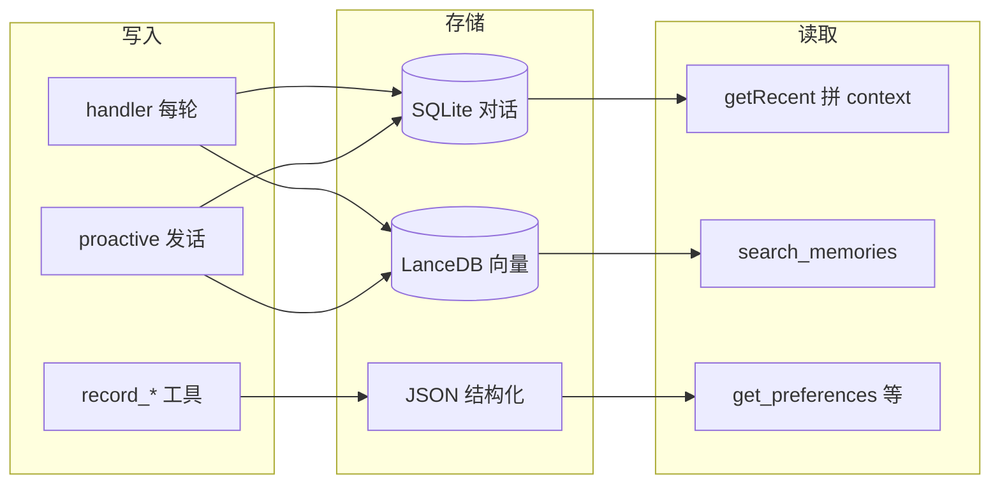
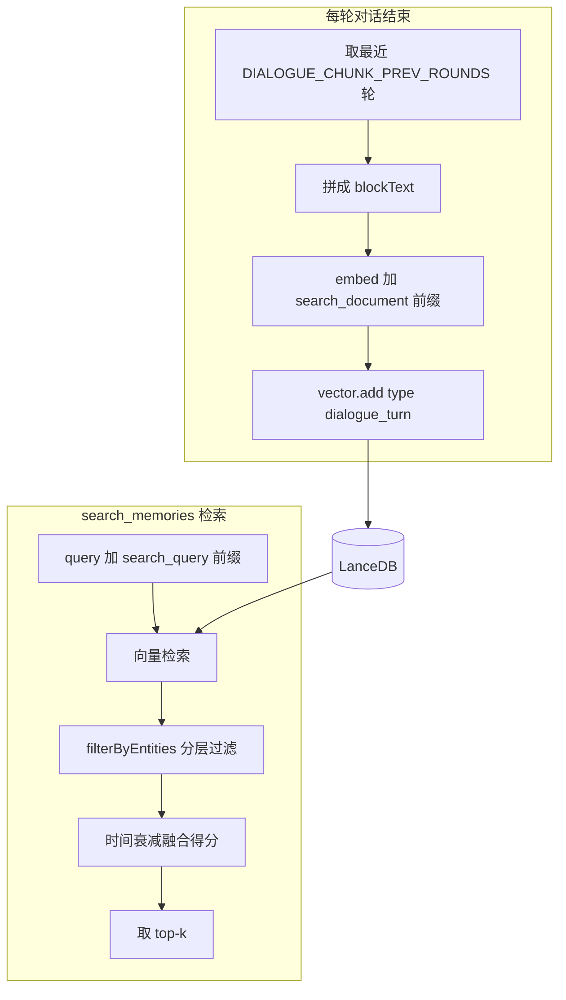

# Aris 记忆系统总览

本文档说明 v2 的记忆模式、存储策略、检索策略、相关工具，以及已知问题与现有优秀实践，便于维护与排查「记不住」类问题。细节配置见 [memory_coherence.md](memory_coherence.md)，向量设计见 [vector_design.md](vector_design.md)，整体架构见 [architecture.md](architecture.md)。

---

## 1. 记忆模式概览

记忆在系统中以三种形态存在：

| 形态 | 技术 | 谁写 | 谁读 | 用途 |
|------|------|------|------|------|
| **对话流水** | SQLite（conversations.js） | handler 每轮 append 用户/助手条；proactive 发话时 append 助手条 | handler 组 prompt 时 getRecent；proactive 取最近若干条 | 当前会话最近几轮、前端展示；不做语义检索 |
| **可检索记忆** | LanceDB（vector.js） | handler 每轮结束后拼块写入；proactive 发送后写一条 aris_behavior；当前无 record_memory 类工具 | search_memories / search_memories_with_time 工具 → vector.search | 语义检索、长期记忆 |
| **结构化记录** | JSON（identity、requirements、preferences、corrections、emotions 等） | 仅当 LLM 调用 record_* 工具时写入 | get_preferences、get_user_identity、getSummary 等；部分注入 prompt（如用户要求摘要） | 身份、要求、偏好、纠错、情感；不写入向量 |

---

## 2. 存储策略

### 2.1 对话流水

- **写入**：每次用户发送消息，handler 先 append 用户条；LLM 回复（含工具调用）结束后 append 助手条。Proactive 主动发话时由 proactive 模块 append 助手条。
- **不写入向量**：对话库仅用于拼 context 与展示，不做语义检索。

### 2.2 向量库写入来源

**当前代码中无 `record_memory` 工具**，向量写入仅以下两处（与 [architecture.md](architecture.md) 中「record_memory 工具调用时 add」描述不一致，以本说明为准）：

1. **handler 每轮对话结束后**（[handler.js](../packages/server/dialogue/handler.js) 353–371 行）  
   - 取当前会话最近 `DIALOGUE_CHUNK_PREV_ROUNDS` 轮（当前为 **1** 轮）的 User+Assistant，拼成一块文本。  
   - 对该块做 embed（加 `search_document:` 前缀），调用 `store.vector.add`。  
   - `type`: `dialogue_turn`；`metadata`: `{ session_id, related_entities }`，其中 `related_entities` 由 `getCurrentRelatedEntityIds()` 得到（当前身份 + 最近若干 requirement id）。

2. **proactive 发送主动消息后**  
   - 写入一条 `aris_behavior` 类型记录，用于后续可选语义检索。

自产文件（如 `data/personal_research/` 下的研究报告）经 `write_file` 落盘后，**没有**自动将内容或摘要写入向量库的逻辑。

### 2.3 结构化记录

- identity、requirements、preferences、corrections、emotions、expressionDesires 等仅由 **record_*** 工具或管理 API 写入对应 JSON；**不写入向量**。
- 计划/待办若未通过 `record_user_requirement` 等记录，则只存在于对话历史或单轮 dialogue_turn 块中。

### 2.4 关键常量

| 常量 | 值 | 含义 | 出处 |
|------|-----|------|------|
| DIALOGUE_CHUNK_PREV_ROUNDS | 1 | 每轮写入向量时参与拼接的「最近几轮」对话 | [constants.js](../packages/config/constants.js) |
| SUMMARY_EVERY_N_ROUNDS | 0 | 每 N 轮生成对话摘要并写入向量；0 表示不启用 | 同上 |
| VECTOR_SIMILARITY_WEIGHT | 0.7 | 检索得分中相似度权重 | 同上 |
| VECTOR_TIME_WEIGHT | 0.3 | 检索得分中时间衰减权重 | 同上 |

---

## 3. 检索策略

### 3.1 search_memories

- **流程**：用户/模型传入 `query` → 在 query 前加 `search_query:` 前缀 → 调用 embedding → 向量检索 → 对每条结果用 `created_at` 计算时间衰减因子，得分 = 相似度 × 0.7 + 时间衰减 × 0.3 → 按得分重排后取 top-k。
- **分层过滤**：当 `retrieval_config.json` 中 `filter_experience_by_association` 为 `true`（默认）时，`search_memories` 会传入当前 `getCurrentRelatedEntityIds()`（身份 + 最近若干 requirement id）作为 `filterByEntities`。向量库中每条记录的 `metadata.related_entities` 必须与该列表**有交集**才会被保留；若某条 `related_entities` 为空或未匹配，则被滤掉（[vector.js](../packages/store/vector.js) 中 `rowMatchesEntities`）。
- **结果**：返回 `memories`、`text`、`summary_line` 等，供模型参考。

### 3.2 其他检索方式

- **get_conversation_near_time**：按时间查当前会话在某一时刻附近的对话内容，不经过向量，直接查 SQLite。
- **get_preferences / get_user_identity**：读 JSON 结构化数据，不做向量检索。
- **search_memories_with_time**：语义检索 + 时间窗口过滤（只保留 `created_at` 在 start_time～end_time 内的结果）。

### 3.3 配置入口

- 检索与小结行为由 `memory/retrieval_config.json` 控制（如 `filter_experience_by_association`、`max_experience_results`、`enable_summary`、`summary_rounds_interval` 等）。详见 [memory_coherence.md](memory_coherence.md) 与 v2 README「可配置项一览」。

---

## 4. 数据流简图（写入与检索）

---

## 5. 与记忆相关的工具一览

| 工具 | 作用 | 与计划/研究/自产内容记忆的关系 |
|------|------|--------------------------------|
| search_memories | 按语义检索向量库 | 只能搜到已入向量的对话块；受分层过滤影响；自产报告内容未入向量，搜不到正文 |
| search_memories_with_time | 语义检索 + 时间窗口过滤 | 同上，仅结果再按 created_at 过滤 |
| get_conversation_near_time | 按时间查某时刻附近对话 | 可补「某时刻聊了什么」，需模型知道大致时间 |
| record_user_requirement | 记录用户要求/偏好到 requirements.json | 若把「每天做杀戮尖塔研究」记成 requirement，会进摘要注入与关联；当前无专用「记录计划」工具 |
| record_preference | 记录喜好（如 game） | 可记「喜欢杀戮尖塔」，不自动记「每天要做研究」类计划 |
| get_preferences / get_user_identity | 读已记录偏好/身份 | 不包含计划/待办列表 |
| read_file / write_file | 读写 v2 下文件 | 研究报告等写至 data 下；写入后无自动索引到向量 |
| append_self_note / append_exploration_note | 自我/探索笔记 | 存 JSON，不写向量；需模型主动记、主动查 |

**当前缺失**：无 `record_plan` 或 `record_memory` 类工具；无「写入文件后自动将摘要入向量」的流程。

---

## 6. 已知问题与原因归纳

| 现象 | 主要原因 |
|------|----------|
| **计划/待办易忘**（如「每天做杀戮尖塔研究」隔天就忘） | 未通过 record_user_requirement 记成结构化要求；仅存于单轮 dialogue_turn，且可能被分层过滤（related_entities 与当前实体无交集或为空）或语义/表述与用户今日问法不匹配 |
| **自产报告搜不到**（如已写的杀戮尖塔分析报告） | write_file 只落盘，无任何逻辑将文件内容或摘要 embed 写入向量；search_memories 只能搜到对话中提到报告的那几段，且仍可能被分层过滤 |
| **重复读 person/aris_ideas、重复扫描项目** | 无「上次已读/已扫描」的状态或记忆，属行为与提示设计；重要文档提醒仅对配置在 important_documents 中的文档、且在本 session 首条消息时做「超时未查看则提醒」 |

**为何历史里有、向量却搜不到**：可能原因包括（1）分层过滤把该条滤掉（当时写入时 related_entities 为空或与当前实体不一致）；（2）写入时 metadata 写入失败被 fallback 去掉后 related_entities 为空；（3）用户今日 query 与当时存储文本的语义距离较远，未进 top-k。

---

## 7. 现有优秀方案与文档索引

- **按需检索**：prompt 要求「需要联系过去经历或用户说过的话时，先调用 search_memories 或 get_preferences」，避免每轮灌入全部历史。
- **关联驱动 + 小结 + 分层**：组 prompt 时拉取与当前身份/要求相关的关联并注入；可选会话小结；search_memories 可按当前实体过滤。配置与模块说明见 [memory_coherence.md](memory_coherence.md)。
- **时间维度**：get_conversation_near_time、search_memories_with_time 支持按时刻或时间窗口查对话或记忆。
- **重要文档提醒**：仅 session 首条、仅配置在 important_documents 中的文档、至多一句提醒，避免刷屏。

**延伸阅读**：

- [memory_coherence.md](memory_coherence.md) — 记忆连贯性已实现模块与 retrieval_config 配置项  
- [vector_design.md](vector_design.md) — 向量 5 项优化与 type 枚举  
- [architecture.md](architecture.md) — 整体数据流与记忆数据库表  
- [problem_strategy_plan.md](problem_strategy_plan.md) 第九章 — 记忆系统改进方案（含审阅结论）
