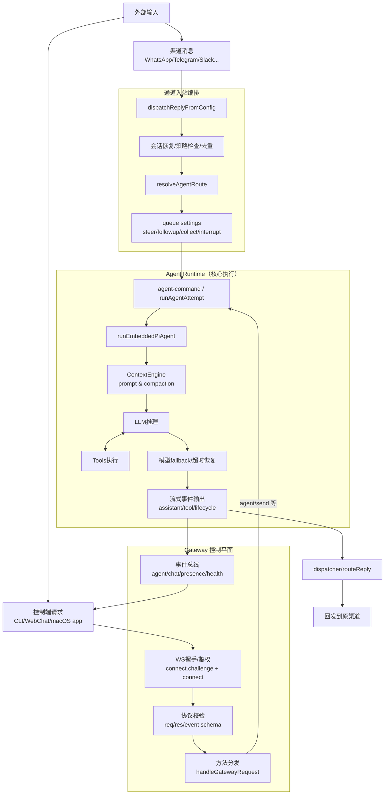

# OpenClaw 底层架构与流程图

## 文档定位

- 目标：帮助快速介绍并理解 OpenClaw 的底层运行原理。
- 范围：基于 `openclaw/openclaw` 源码主链路（Gateway、auto-reply、routing、agent runtime）。
- 固定位置：`v2/docs/openclaw_architecture_flow.md`

## 一句话本质

OpenClaw 不是单体聊天脚本，而是一个 **Gateway 控制平面**：所有客户端与消息通道都接入 Gateway，再由统一的 Agent Runtime 执行推理与工具调用，最后将结果流式回传。

## 核心分层

1. 入口层
   - 通道入站：WhatsApp/Telegram/Slack 等通过 channel/plugin 进入。
   - 控制端入站：CLI、WebChat、macOS app 通过 WebSocket RPC 调用。

2. 协议与控制层（Gateway）
   - `connect.challenge -> connect` 完成握手、鉴权、能力协商。
   - 统一 `req/res/event` 协议帧校验与方法分发。
   - 维护全局状态与事件广播（agent/chat/presence/health）。

3. 路由层
   - 根据 channel/account/peer/guild/team 等维度解析 agent 与 session。
   - 路由优先级从高到低：peer -> parent peer -> guild+roles -> guild -> team -> account -> channel -> default。

4. 执行编排层（auto-reply）
   - 入站消息去重、策略判断、会话恢复、队列模式决策。
   - 形成 `followupRun`，转交 Agent Runtime 执行。

5. Agent Runtime
   - `agent-command` 负责编排和生命周期事件兜底。
   - `runAgentAttempt` 选择执行器（CLI provider 或 embedded runtime）。
   - `runEmbeddedPiAgent` 执行真实推理回路：prompt、工具调用、流式输出、容错恢复。

6. 可靠性层
   - 按 session lane 串行执行，避免并发写同一会话导致上下文乱序。
   - 模型 fallback、超时 compaction、tool result truncation、幂等键去重。

## 端到端流程图（Mermaid）

## 关键运行细节（讲解重点）

- 统一控制平面
  - 所有能力都通过 Gateway 方法暴露，协议统一，客户端实现成本低。

- 会话串行与队列策略
  - 以 session lane 为执行单位，防止并发竞争。
  - 队列模式支持 steer/followup/collect/interrupt，控制“正在回复时新消息如何处理”。

- 流式可观测
  - `assistant/tool/lifecycle` 三类事件构成完整执行轨迹。
  - `agent.wait` 可等待 run 完成状态（ok/error/timeout）。

- 容错不等于直接失败
  - 优先 compaction 与重试，再 fallback，不轻易丢弃用户回合。

## 常见问答（速查）

- 为什么它能同时接很多渠道？
  - 渠道接入与 Agent 执行解耦，渠道只负责 ingress/egress，核心决策在统一 runtime。

- 为什么回复不会乱序？
  - 同一 session 走同一 lane 串行处理，且有队列策略和幂等去重。

- 为什么“看起来很实时”？
  - 流式事件在推理和工具调用过程中持续推送，不必等完整回合结束。

## 建议维护约定

- 以后如果继续补充 OpenClaw 相关分析，统一追加在本文件，避免内容散落。
- 若后续内容增多，可拆分为：
  - `v2/docs/openclaw_architecture_flow.md`（总览）
  - `v2/docs/openclaw_runtime_deep_dive.md`（执行细节）
  - `v2/docs/openclaw_protocol_notes.md`（协议与网关）
